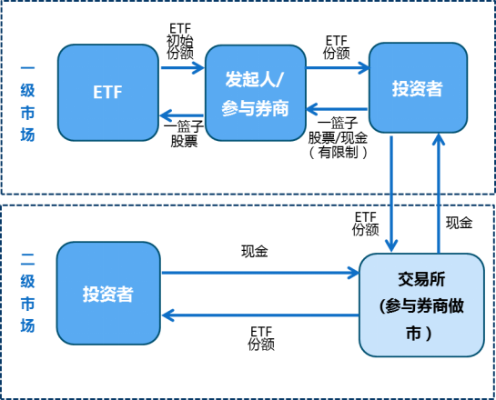
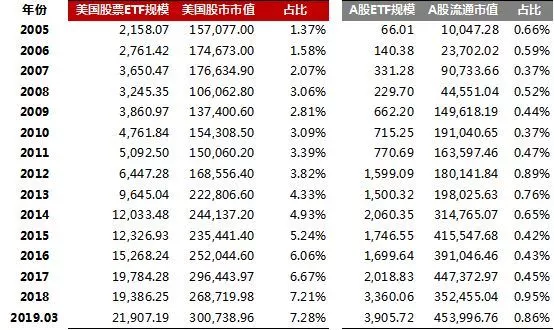

在市场生存，理解市场的逻辑永远是第一位的，量化也只有在此基础上才有价值。

所以，这一篇来说说时下大热的ＥＴＦ。

## 1. ETF是什么

>交易型开放式指数基金，通常又被称为交易所交易基金（Exchange Traded Fund，简称ETF），是一种在交易所上市交易的、基金份额可变的一种开放式基金。

其优点就不多说了，大概有下面几点:
- 分散投资并降低投资风险
- 兼具股票和指数基金的特色
- 结合了封闭式与开放式基金的优点
- 交易成本低廉
- 投资者可以当天套利
- 高透明性

优点那么多，火起来自然就不奇怪了。

## 2. 为什么ETF火了

ETF的火，大概跟巴菲特的极力推荐有关，并且，根据统计，80%以上的美国主动管理型股票基金的表现低于标普1500综合指数(SP1500)，这个放到中国，估计也差不多。

既然忙活半天，收益还不如指数，还不如就买指数。

于是，天才的金融家设计了ETF,你不但可以买指数，还可以随时变现，并且成本还极低。

而对于基金经理来说，这下轻松了，什么调研，选股，仓位管理，清盘，业绩压力,都不存在了；我只要跟踪指数并复制组合就可以了，只要 **跟踪误差**　不大就行------尼玛，这不是计算机更擅长的事吗？这么没技术含量的事，基金经理有奖金吗？这个不用担心，只要规模够大，收管理费足够活得滋润。

这样的好事，当然是越多越好，于是，这个市场就滚起来的。

那么，ETF的运行机制是怎样的呢？

## 3. ETF的运行机制

任何一个金融产品，参与之，一定要了解其运行机制。

一图胜千言:

这里的关键点:
- 初始份额是拿 **钱** 买组合形成 **ETF初始份额**
- ETF的份额的增减只能从一级市场产生
- 一级市场的交易是　**ETF份额**　 和　**股票组合**　的交换
- 由于套利机制的存在，二级市场交易价格基本等于其净值
- 二级市场交易只是交易 **ETF份额**，　不是真正的股票买卖，不会对真正的 **股价** 产生影响

这样的机制会产生什么影响呢?

## 4. 可能的影响

根据ETF的运行机制，我们假设大家非常看好它，都在买买买，新基不断成立，ETF份额不断扩大，理论上其规模是可以接近跟踪指数的规模的，那么市场会发生什么？

我们假设ETF规模接近其跟踪指数的50%,由于市场太好，一级市场也没什么人选择赎回。

这时，其实市场只有50%的股票是流通的。

如果ETF规模接近80%,那么，市场只有20%是流通的。

注意到了吗？20%的流通定价，决定了80%的ETF二级市场价格。

这意味着什么？

这意味着市场的定价是扭曲的！

市场好的时候，将会给ETF持有人一种错觉，我的ETF真的值那么多钱。

而如果一级市场的人，选择在二级市场卖出，嗯，这根本不会对股价有任何冲击，最后，ETF份额全部分散在大众手里。

这时，赎回也就是把 **ETF份额** 换成 **股票组合** 的操作会发生吗？

赎回是有额度要求的，我们假设持有人都达不到额度，那么，其就只能选择在二级市场卖出。

那么，赎回不会发生。

而这时，股票市场的估值由于太高，ETF资金的流入也达到了一个临界点。

会发生什么？

由于流通盘很小，那么，很小的砸盘就可以把ＥＴＦ的净值打回原形。

如果ETF持有人达到赎回的额度，可能会选择赎回，因为这时二级市场根本接不了盘，可能会出现折价的情况；赎回后，肯定会第一时间卖出，加速市场下跌。

达不到赎回额度的，要么死扛，要么折价卖出。

所以，ETF是有可能降低市场的流动性和扭曲市场定价的。

当然，目前A股的ETF市场份额还远远不足以产生这种效果，并且还在快速发展中。

但，如果有一天，ETF的死多头足够多的时候，发生上面描述的事情，请不要觉得奇怪。

## 5. 当下的策略

只有对当下的情况足够了解，才能够做出正确的策略。

先看一下目前ETF的规模:

配合A股目前的估值，以及ETF的优势，目前不管是做资产配置还是二级市场波段操作，都是值得参与的。

特别是在比较确定性的情况下，敢于重仓指数ETF是一个聪明省事的策略。

## 6. 小结

价格发现，从来不可能是那么省事的。

ETF是个好东西，但是像所有的被动投资一样，任何由无脑买入决定的资产定价，一定会在某个时刻，反噬之。

只是，舞曲没有停下来之前，谁会离开舞池呢？

>这整个世界就是一个骗局,要及早的参与其中,并在骗局被所有人识破之前离开。

延伸阅读:

[*ETF大年：今年规模猛增40%，未来空间还有多大？*](https://finance.qq.com/a/20190918/007031.htm)

[*ETF将导致市场崩盘？来自大空头麦克·贝利的看法*](http://finance.sina.com.cn/money/fund/jjcl/2019-09-11/doc-iicezzrq4908537.shtml)

[*下一目标：摧毁基金*](http://blog.sina.com.cn/s/blog_486e105c010008jn.html)

---
**知乎专栏**:  
https://zhuanlan.zhihu.com/automoney  

**github**:  
https://github.com/zvtvz/automoney

**公众号**:  

