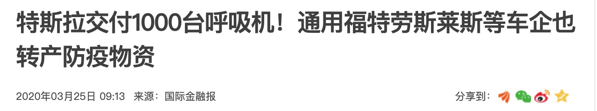
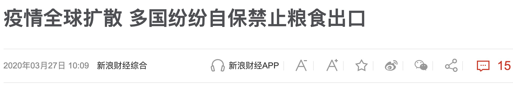
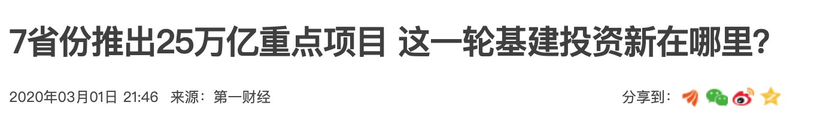
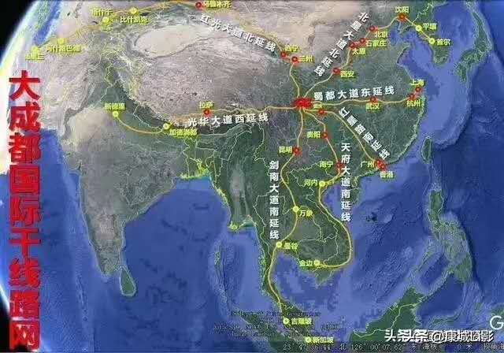

这篇文章不需要任何的准备，可以直奔主题。

## 1. 保命
在此COVID-19肆虐全球之际，就让莎翁那段让人起鸡皮疙瘩的咏叹再次撞击我们的灵魂吧！

> "生存还是毁灭，这是一个问题.

> 是默默忍受命运的暴虐和毒箭；还是愤然反抗人世中无涯的苦难并通过斗争将它们清除干净，哪一种更高贵？

> 死了，睡了，难道就什么都没了？如果说，在睡着的梦境中我们的心头的创痛以及无数血肉之躯所不能避免的打击，都可以从此消失得无影无终，那该有多好！

>但，死去如同睡去——睡着了会做梦，该如何去面对那未知的死去的梦境？我们踌躇犹豫，顾虑万分。也因如此，我们才甘心久困于这患难之中。

>毕竟，谁愿意忍受人世的鞭挞和讥嘲、压迫者的凌辱、傲慢者的冷眼、被轻蔑的爱情的惨痛、法律的迁延、官吏的横暴和费尽辛勤所换来的小人的鄙视，要是能用一柄小小的刀了却余生？谁愿意负着这样的重担，在繁重辛劳的生命的压迫下呻吟流汗。又有谁，不是在惧怕那个不可知的死后，那个不曾有旅人归来的神秘之国呢？"

### 所以，我想说的第一个主题是：保命！

翻译:草泥马的，通用，福特，你这帮傻b，重要的事情说三遍，快，快，就现在，呼吸机，呼吸机。。。

据说鱼跃，长峰，中鼎等......

作为生产大后方的中国，有医疗相关产品输出能力的个股在可以预见的将来业绩必然是爆发式的增长。
## 2. 吃饭
如果你不知道什么是疯狂，那是因为你还没尝过饥饿的滋味。

在为吃而狂，yy什么“唯美食不可辜负”之际，还是让圆觉经那悲悯的咒语荡涤一下吧！

>"恒作是念，我今此身，四大和合，所谓发毛爪齿，皮肉筋骨，髓脑垢色，皆归于地，唾涕脓血，津液涎沫，痰泪精气，大小便利，皆归于水，暖气归火，动转归风，四大各离，今者妄身，当在何处，即知此身，毕竟无体，和合为相，实同幻化，四缘假合，妄有六根，六根四大，中外合成，妄有缘气，于中积聚，似有缘相，假名为心。"

也可以听听钟老的随缘说法。
>钟南山:“我觉得最宝贵的几个经验，第一条经验：任何工作代替不了身体的锻炼；第二是心态，健康的一半是心理健康，疾病的一半是心理疾病。我的经历多，心态比较好，很多事情可以一笑置之。第三是不要吃太饱，我从来不会吃太饱，早餐非常重要。 没有全民的健康就没全民的小康。希望大家都可以80、90岁都能为国家做贡献，我们的民族一定会非常强大。”

### 所以，我想说的第二个主题是：吃饭！

摘录一段:
>
"随着冠病疫情扩散，除了世界各地民众开始囤积粮食与日用品，多国政府也启动了粮食库存计划，以保障国家的粮食供应充足。

主要小麦输出国哈萨克斯坦已禁止小麦、胡萝卜，糖和马铃薯等产品出口；塞尔维亚已停止葵花籽油等货品出口，并会每周检讨禁令中的产品清单；越南海关总署要求自3月24日起暂停各种形式的大米出口。这种为国民储备粮食的浪潮令人担心国际供应链受干扰。"

据说中粮，深粮，京粮等......

手中有粮，心中不慌！
只要防住外来疫情输入，大家不饿肚子，虽然我很不想这么说，但在中国为世界抗疫争取了宝贵的时间并被某些蛮夷傲慢的浪费了之后，就如二战期间某国成为盟军生产的大后方一样，中国就是这次大战的生产大后方！

## 3. 搞基
虽然本人对搞基深恶痛绝，但无可否认，在乌托邦“美丽的人”已经变成现实的今天，相比女性的气概和男性的娇嗔，纯洁的友谊真的就非常宝贵了。

在开始之前，先看一段缠师对搞基的精彩描写吧！

>"说实在，本ID对他的音乐确实没什么好感。并不是因为他是所谓的同志，最后还因同志而死。更不是说，喜欢这俄罗斯同志音乐的人都被本ID视为同志而不耻。音乐界的同志实在太多了，简直到了触目惊心的地步。如果本ID因其同志就不喜欢其音乐，那至少如下同志的音乐就要被封杀：贝多芬、舒伯特、马勒。贝多芬还不仅仅是同志那么简单，其涉及乱伦的、对其侄子的不伦行为，估计会让李银河等特别兴奋。而他这柴可夫斯基名字，也忒逗了点儿，“可夫”且“基”，真应了中国人“有中错状元，没改错名字”的老话。"

>"但音乐就是音乐，音乐家只用音乐说话，音乐家的墓碑是用音乐垒成的。即使贝多芬刚强奸完他的侄子，回头就去写他的交响乐、弥撒曲。贝多芬的音乐依然贝多芬，其中只有伟大的心灵和伟大的音乐，而不是叔侄之间乱伦的呻吟、叫床。相比之下，这位俄罗斯同志的行为，简直是小事一桩，值得他为此而死吗？值得他为此而内心挣扎吗？这种软弱的人写出来的音乐，只能是草间虫鸣，哪能像贝多芬那样，乱伦也乱得气势磅礴、傲视群雄。所以贝多芬是贝多芬，俄罗斯同志只能是俄罗斯同志，两者是不能比的。"

### 所以，我想说的第二个主题是：搞基！

如果有什么是搞一次基搞不定的，那就搞两次！

4万亿算个屁，25万亿老子眼睛都不眨一下！

具体个股就不说了，搞基肯定要先来电，并且是特高压的那种。。。

让我们以一首诗来结束这狂乱的夜晚吧：

啊！大海啊 你全是水！骏马啊 你四条腿！姑娘，就让那激情澎湃的钢铁爬满你的地球吧！

## 4. 小结
我说这些，并不是说他们有多好，只是他们进入了可以搞的范围。

具体搞哪个？以什么姿势去搞？搞多久？不同的技术，经验，心态，最后能不能赚钱，赚多少都是千差万别的。

因为，除了灵感，更重要的是枯燥的训练，严格的纪律。

好了，祝大家赚钱。

个人微信:foolcage 添加暗号:zvt  

---
**知乎专栏**:  
https://zhuanlan.zhihu.com/automoney  

**github**:  
https://github.com/zvtvz/zvt

