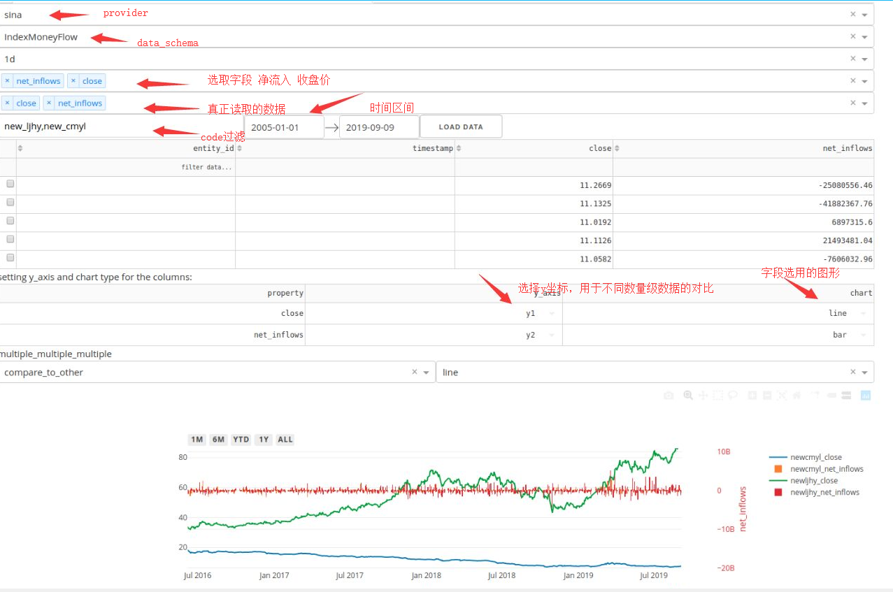

阅读下面文章前，请保证[**zvt**](https://github.com/zvtvz/zvt)的环境已经准备好。

>源码:  
>https://github.com/zvtvz/zvt  
>https://gitee.com/null_071_4607/zvt

>文档:  
>https://zvtvz.github.io/zvt/  
>http://zvt.foolcage.com

## 1. 资金流相关概念

资金流本质上是资金进出的记录，对其进行各种维度的观察，从而了然市场的资金在干什么，进而选择该干什么，是非常有意义的。  

### 1.1 竞价交易
对于 **价格优先 时间优先** 的 **竞价交易** 市场，成交的方式有三种：

- 买盘

当买盘主动**吃掉**卖盘时发生

- 卖盘

当卖盘主动**吃掉**卖盘时发生

- 中性盘

买卖盘**同时**打出了相同的价格并成交

### 1.2 资金流
而 **资金流** 就是对买卖盘的统计，分为:  

- 资金流入

买盘的累加

- 资金流出

卖盘的累加

- 净流入

资金流入-资金流出

### 1.3 资金流的分类

### 1.3.1 纵向分类
而根据成交金额大小的不同，可以分为：  

- 主力流入
- 主力流出
- 散户流入
- 散户流出

> 不同的数据提供商对　**主力**　和　**散户**　**成交金额** 的定义不同，但这并不影响操作，知道其含义即可。

例如，新浪对大，中，小单，主力，散户的定义如下：
>
主力	　	单笔成交额>=100万元  
散户	　	单笔成交额<=5万元  
小单	　	单笔成交5万元-20万元  
大单	　	单笔成交20万-100万元  
特大单	　	单笔成交100万元以上  


### 1.3.2 横向分类
而统计标的的不同，又可以分为：  

- 个股资金流
- 板块资金流
- 大盘资金流

这个很好理解，板块和大盘不过是个股资金流的累加。

### 1.4 资金流的几个观察

- 单日资金流意义不大,一般统计某个窗口(10日，２０日)才有参考价值
- 巨量流出(流入)伴随高位(低位)往往是见顶(底)的标志
- 下跌中流入，上涨中流出，往往会形成所谓的背驰（背离）

这些都可以通过数据来对其进行佐证，下一节会在回测策略中对其进行更具体的分析。

## 2. 数据结构定义

zvt数据的使用需要在domain里面先对其进行定义，[*money_flow*](https://github.com/zvtvz/zvt/blob/master/zvt/domain/money_flow.py)的定义如下：

```
# 板块资金流向
@register_api(provider='sina')
class IndexMoneyFlow(MoneyFlowBase, Mixin):
    __tablename__ = 'index_money_flow'

    code = Column(String(length=32))
    name = Column(String(length=32))

    # 收盘价
    close = Column(Float)
    change_pct = Column(Float)
    turnover_rate = Column(Float)

    # 净流入
    net_inflows = Column(Float)
    # 净流入率
    net_inflow_rate = Column(Float)

    # 主力=超大单+大单
    net_main_inflows = Column(Float)
    net_main_inflow_rate = Column(Float)
    # 超大单
    net_huge_inflows = Column(Float)
    net_huge_inflow_rate = Column(Float)
    # 大单
    net_big_inflows = Column(Float)
    net_big_inflow_rate = Column(Float)

    # 中单
    net_medium_inflows = Column(Float)
    net_medium_inflow_rate = Column(Float)
    # 小单
    net_small_inflows = Column(Float)
    net_small_inflow_rate = Column(Float)


@register_api(provider='sina')
class StockMoneyFlow(MoneyFlowBase, Mixin):
    __tablename__ = 'stock_money_flow'

    code = Column(String(length=32))
    name = Column(String(length=32))

    # 收盘价
    close = Column(Float)
    change_pct = Column(Float)
    turnover_rate = Column(Float)

    # 净流入
    net_inflows = Column(Float)
    # 净流入率
    net_inflow_rate = Column(Float)

    # 主力=超大单+大单
    net_main_inflows = Column(Float)
    net_main_inflow_rate = Column(Float)
    # 超大单
    net_huge_inflows = Column(Float)
    net_huge_inflow_rate = Column(Float)
    # 大单
    net_big_inflows = Column(Float)
    net_big_inflow_rate = Column(Float)

    # 中单
    net_medium_inflows = Column(Float)
    net_medium_inflow_rate = Column(Float)
    # 小单
    net_small_inflows = Column(Float)
    net_small_inflow_rate = Column(Float)


register_schema(providers=['sina'], db_name='money_flow', schema_base=MoneyFlowBase)
```

这里的关键点在于，数据的注册：

```
register_schema(providers=['sina'], db_name='money_flow', schema_base=MoneyFlowBase)
```

其中providers可以设置多个，比如providers=['sina','eastmoney'],这样就可以进行数据的交叉验证了。zvt里面对数据的处理是先定义数据标准格式，然后注册支持数据的provider,这为数据的稳定性提供了坚实的基础，即使某些provider不可用了，也不会影响后面的分析程序。

## 3. 获取板块资金流

### 3.1 选择基类　[**FixedCycleDataRecorder**](https://github.com/zvtvz/zvt/blob/b98ec1f654e00bfda37998d279464f0229890153/zvdata/recorder.py#L397:7)

一般来说，获取一类数据，需要明确其是entity还是entity发生的event;板块资金流是 **板块**　**发生资金流入**　这类event的记录，然后其还是个固定时间序列的数据，所以通过继承　FixedCycleDataRecorder　来实现。

那么，有哪些板块呢？

这个在 [**SinaChinaStockCategoryRecorder**](https://github.com/zvtvz/zvt/blob/b98ec1f654e00bfda37998d279464f0229890153/zvt/recorders/sina/meta/sina_china_stock_category_recorder.py) 已经实现。

我们在ipython里面来看一下:
```
In [8]: from zvt.api import *

In [9]: df = get_blocks(provider='sina',block_category='industry')
In [10]: df.loc[:,['code','name']]
Out[10]: 
                code  name
code                      
new_blhy    new_blhy  玻璃行业
new_cbzz    new_cbzz  船舶制造
new_cmyl    new_cmyl  传媒娱乐
new_dlhy    new_dlhy  电力行业
new_dqhy    new_dqhy  电器行业
new_dzqj    new_dzqj  电子器件
new_dzxx    new_dzxx  电子信息
new_fdc      new_fdc   房地产
new_fdsb    new_fdsb  发电设备
new_fjzz    new_fjzz  飞机制造
new_fzhy    new_fzhy  纺织行业
new_fzjx    new_fzjx  纺织机械
new_fzxl    new_fzxl  服装鞋类
new_glql    new_glql  公路桥梁
new_gsgq    new_gsgq  供水供气
new_gthy    new_gthy  钢铁行业
new_hbhy    new_hbhy  环保行业
new_hghy    new_hghy  化工行业
new_hqhy    new_hqhy  化纤行业
new_jdhy    new_jdhy  家电行业
new_jdly    new_jdly  酒店旅游
new_jjhy    new_jjhy  家具行业
new_jrhy    new_jrhy  金融行业
new_jtys    new_jtys  交通运输
new_jxhy    new_jxhy  机械行业
new_jzjc    new_jzjc  建筑建材
new_kfq      new_kfq   开发区
new_ljhy    new_ljhy  酿酒行业
new_mtc      new_mtc   摩托车
new_mthy    new_mthy  煤炭行业
new_nlmy    new_nlmy  农林牧渔
new_nyhf    new_nyhf  农药化肥
new_qczz    new_qczz  汽车制造
new_qtxy    new_qtxy  其它行业
new_slzp    new_slzp  塑料制品
new_snhy    new_snhy  水泥行业
new_sphy    new_sphy  食品行业
new_stock  new_stock   次新股
new_swzz    new_swzz  生物制药
new_sybh    new_sybh  商业百货
new_syhy    new_syhy  石油行业
new_tchy    new_tchy  陶瓷行业
new_wzwm    new_wzwm  物资外贸
new_ylqx    new_ylqx  医疗器械
new_yqyb    new_yqyb  仪器仪表
new_ysbz    new_ysbz  印刷包装
new_ysjs    new_ysjs  有色金属
new_zhhy    new_zhhy  综合行业
new_zzhy    new_zzhy  造纸行业
```

### 3.2 具体实现　[**新浪板块资金流**](https://github.com/zvtvz/zvt/blob/b98ec1f654e00bfda37998d279464f0229890153/zvt/recorders/sina/money_flow/sina_index_money_flow_recorder.py)

几个重要的点(所有的数据记录都遵守的规则)：
#### 3.2.1 指定 provider 和 schema
```
    #entity的信息从哪里来
    entity_provider = 'sina'
    #entity的schema
    entity_schema = Index
    
    #记录的信息从哪里来
    provider = 'sina'
    #记录的schema
    data_schema = IndexMoneyFlow
```

### 3.2.2 覆盖 init_entities

在　init_entities　中设置需要抓取的entity,这里是新浪提供的概念和行业。
```
    def init_entities(self):
        self.entity_session = get_db_session(provider=self.entity_provider, data_schema=self.entity_schema)

        self.entities = get_entities(session=self.entity_session, entity_type='index',
                                     exchanges=self.exchanges,
                                     codes=self.codes,
                                     entity_ids=self.entity_ids,
                                     return_type='domain', provider=self.provider,
                                     # 只抓概念和行业
                                     filters=[Index.category.in_(
                                         [StockCategory.industry.value, StockCategory.concept.value])])
```

> [**recorder**](https://github.com/zvtvz/zvt/blob/master/zvdata/recorder.py)类会自动遍历相应的entity,并从其相应的历史记录的最新位置继续抓取。

### 3.2.3 实现抓取逻辑
```
    def record(self, entity, start, end, size, timestamps):
        url = self.generate_url(category=entity.category, code=entity.code, number=size)

        resp = requests.get(url)

        opendate = "opendate"
        avg_price = "avg_price"
        avg_changeratio = 'avg_changeratio'
        turnover = 'turnover'
        netamount = 'netamount'
        ratioamount = 'ratioamount'
        r0_net = 'r0_net'
        r0_ratio = 'r0_ratio'
        r0x_ratio = 'r0x_ratio'
        cnt_r0x_ratio = 'cnt_r0x_ratio'

        json_list = []
        try:
            json_list = eval(resp.text)
        except Exception as e:
            resp.encoding = 'GBK'
            self.logger.error(resp.text)
            time.sleep(60 * 5)

        result_list = []
        for item in json_list:
            result_list.append({
                'name': entity.name,
                'timestamp': to_pd_timestamp(item['opendate']),
                'close': to_float(item['avg_price']),
                'change_pct': to_float(item['avg_changeratio']),
                'turnover_rate': to_float(item['turnover']) / 10000,
                'net_inflows': to_float(item['netamount']),
                'net_inflow_rate': to_float(item['ratioamount']),
                'net_main_inflows': to_float(item['r0_net']),
                'net_main_inflow_rate': to_float(item['r0_ratio'])
            })

        return result_list
```

### 3.2.4 测试抓取
```
if __name__ == '__main__':
    SinaIndexMoneyFlowRecorder(codes=['new_dzxx']).run()
```

这里的codes就是刚才查询有哪些板块里面的codes,zvt里面recorder提供了统一的调用方式：使用某些codes做测试，测试没问题后再全量抓取。

### 3.2.5 全量定时抓取　[**sina_runner**](https://github.com/zvtvz/zvt/blob/b98ec1f654e00bfda37998d279464f0229890153/zvt/recorders/sina/sina_runner.py)
```
@sched.scheduled_job('cron', hour=17, minute=00)
def run():
    while True:
        try:
            SinaChinaStockCategoryRecorder().run()

            SinaIndexMoneyFlowRecorder().run()
            break
        except Exception as e:
            logger.exception('sina runner error:{}'.format(e))
            time.sleep(60)


if __name__ == '__main__':
    init_process_log('sina_runner.log')

    run()

    sched.start()

    sched._thread.join()

```

定时器里面设置的是每天下午5点抓取　**板块**　和　**资金流**　数据，你可以根据自己的需要来进行调整。

>linux可以用如下命令起一个常驻进程：  
nohup python zvt/recorders/sina/sina_runner.py >/dev/null 2>&1 &

## 4. 资金流api

有了定时增量更新的数据，我们就可以只把精力放在数据的使用上了
```
In [16]: df=get_index_money_flow(provider='sina',codes=['new_cmyl','new_jrhy'])

In [17]: df
Out[17]: 
                                      id          entity_id  timestamp      code  name    close  change_pct  turnover_rate   net_inflows  net_inflow_rate  net_main_inflows  net_main_inflow_rate 
timestamp
2011-06-16  index_cn_new_cmyl_2011-06-16  index_cn_new_cmyl 2011-06-16  new_cmyl  传媒娱乐  11.2669   -0.016522       0.007802 -2.508056e+07        -0.041988      5.198664e+06              0.008703  
2011-06-16  index_cn_new_jrhy_2011-06-16  index_cn_new_jrhy 2011-06-16  new_jrhy  金融行业   5.0747   -0.005256       0.001426 -4.057816e+07        -0.006909     -1.272530e+08             -0.021667  
2011-06-17  index_cn_new_cmyl_2011-06-17  index_cn_new_cmyl 2011-06-17  new_cmyl  传媒娱乐  11.1325   -0.011932       0.005178 -4.188237e+07        -0.106854      2.341741e+06              0.005974  
2011-06-17  index_cn_new_jrhy_2011-06-17  index_cn_new_jrhy 2011-06-17  new_jrhy  金融行业   5.0531   -0.002186       0.001699 -4.992907e+08        -0.071639     -1.747691e+08             -0.025076  
2011-06-20  index_cn_new_cmyl_2011-06-20  index_cn_new_cmyl 2011-06-20  new_cmyl  传媒娱乐  11.0192   -0.010178       0.005508  6.897316e+06         0.016720      7.367255e+06              0.017859  
```

## 5. 使用zvt的可视化分析

按以上规则在zvt中定义的数据，是可以直接使用其可视化工具进行分析的
<p align="center"></p>

其中codes过滤使用的是　**酿酒行业**　和　**传媒娱乐**，可以看出传媒娱乐基本上是被资金抛弃的板块，股价也是一直低迷。
> codes可以参看上面获取板块的api使用

## 6. 小结

通过这篇文章，我们基本了解了资金流是什么，zvt中数据的定义，抓取，api使用以及基本的可视化分析。
那么，如何在zvt中使用　**板块资金流**　和　**个股资金流** 来选股并做回测呢？　我们下一节见！