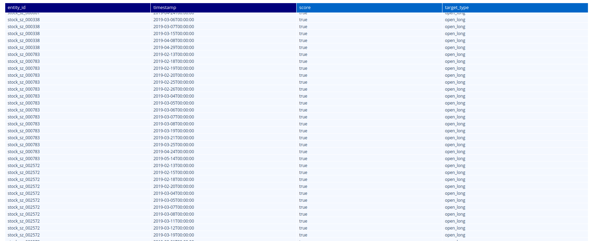

阅读下面文章前，请保证[**zvt**](https://github.com/zvtvz/zvt)的环境已经准备好。

>源码:  
>https://github.com/zvtvz/zvt  
>https://gitee.com/null_071_4607/zvt

>文档:  
>https://zvtvz.github.io/zvt/  
>http://zvt.foolcage.com

## 1. 一段时间资金的动向

如果今天资金流入，你就买，明天资金流出，你就卖，你的成功率不会很高；我们需要关注的是，一段时间资金的动向。

一段时间，就是　窗口(window)；而好坏都是对比出来的，所以，我们需要排序。

可以这么选择：最近２０天　净流入额　和　流入率　排名前３的板块

这里的参数可以自己调整，这跟自己交易周期的偏好有关，并无绝对好坏之分；但有一点是肯定的，只参与资金关注的板块。

## 2. 实现自己的factor

zvt里面有三类factor：FilterFactor,ScoreFactor,StateFactor。

我们的算法是：２０日流入额和流入率越高，分数就越高，所以，选择ScoreFactor。

```
class IndexMoneyFlowFactor(ScoreFactor):
    def __init__(self,
                 the_timestamp: Union[str, pd.Timestamp] = None,
                 start_timestamp: Union[str, pd.Timestamp] = None,
                 end_timestamp: Union[str, pd.Timestamp] = None,
                 columns: List = [IndexMoneyFlow.net_inflows, IndexMoneyFlow.net_inflow_rate,
                                  IndexMoneyFlow.net_main_inflows, IndexMoneyFlow.net_main_inflow_rate],
                 filters: List = None,
                 order: object = None,
                 limit: int = None,
                 provider: str = 'sina',
                 level: Union[str, IntervalLevel] = IntervalLevel.LEVEL_1DAY,
                 category_field: str = 'entity_id',
                 time_field: str = 'timestamp',
                 trip_timestamp: bool = True,
                 auto_load: bool = True,
                 keep_all_timestamp: bool = False,
                 fill_method: str = 'ffill',
                 effective_number: int = 10,
                 scorer: Scorer = RankScorer(ascending=True)) -> None:
        super().__init__(IndexMoneyFlow, None, 'index', None, None, the_timestamp, start_timestamp,
                         end_timestamp, columns, filters, order, limit, provider, level, category_field, time_field,
                         trip_timestamp, auto_load, keep_all_timestamp, fill_method, effective_number, scorer)

    def pre_compute(self):
        self.depth_df = self.data_df.copy()
        self.depth_df = self.depth_df.groupby(level=1).rolling(window=20).mean()
        self.depth_df = self.depth_df.reset_index(level=0, drop=True)
        self.depth_df = self.depth_df.reset_index()
        self.depth_df = index_df_with_category_xfield(self.depth_df)

```

在评分之前首先把所有时间点的值进行window计算：
```
    def pre_compute(self):
        self.depth_df = self.data_df.copy()
        self.depth_df = self.depth_df.groupby(level=1).rolling(window=20).mean()
        self.depth_df = self.depth_df.reset_index(level=0, drop=True)
        self.depth_df = self.depth_df.reset_index()
        self.depth_df = index_df_with_category_xfield(self.depth_df)

```

然后使用Scorer来对其进行评分，即标准化为[0,1]的分数，这里我们直接使用zvt里面已经实现的 [**RankScorer**](https://github.com/zvtvz/zvt/blob/master//zvdata/score_algorithm.py#L16:7):
```
class RankScorer(Scorer):
    def __init__(self, ascending=True) -> None:
        self.ascending = ascending

    def compute(self, input_df) -> pd.DataFrame:
        result_df = input_df.groupby(level=1).rank(ascending=self.ascending, pct=True)
        return result_df
```

groupby(level=1)意思是按时间分组，rank评分规则是　升序　和　百分比，这样我们就得到了一个标准的zvt二维索引DataFrame,level０为标的，level１为时间序列。


## 3. 选择器

分数有了，我们就可以定义 [**TargetSelector**](https://github.com/zvtvz/zvt/blob/master//zvt/factors/target_selector.py#L26:7) 来选择标的了。

```
class IndexSelector(TargetSelector):

    def __init__(self, entity_ids=None, entity_type='stock', exchanges=['sh', 'sz'], codes=None, the_timestamp=None,
                 start_timestamp=None, end_timestamp=None, long_threshold=0.8, short_threshold=0.2,
                 level=IntervalLevel.LEVEL_1DAY, provider='sina', block_selector=None) -> None:
        super().__init__(entity_ids, entity_type, exchanges, codes, the_timestamp, start_timestamp, end_timestamp,
                         long_threshold, short_threshold, level, provider, block_selector)

    def init_factors(self, entity_ids, entity_type, exchanges, codes, the_timestamp, start_timestamp, end_timestamp,
                     level):
        index_factor = IndexMoneyFlowFactor(start_timestamp=start_timestamp, end_timestamp=end_timestamp, level=level,
                                            provider='sina', codes=codes)
        self.score_factors.append(index_factor)
```

这里设置long_threshold为0.8,意思就是比８０％的其他板块分数要高。

在ipython里面看一下：
```
In [1]: from examples.factors.composite_selector import *
        from zvt.api import *
In [2]: df = get_blocks(provider='sina', block_category='industry') 
        index_selector = IndexSelector(entity_type='index', exchanges=None, start_timestamp='2019-01-01',
                                       end_timestamp=now_pd_timestamp(), codes=df['code'].to_list())
        index_selector.run()
```

看一看某天选出的板块:
```
In [12]: blocks =  index_selector.get_targets(timestamp='2019-09-02')
In [13]: get_index(entity_ids=blocks,provider='sina')
Out[13]: 
                          id          entity_id timestamp entity_type exchange      code  name is_delisted  category base_point list_date
timestamp
NaT        index_cn_new_jdhy  index_cn_new_jdhy      None       index       cn  new_jdhy  家电行业        None  industry       None      None
NaT        index_cn_new_jdly  index_cn_new_jdly      None       index       cn  new_jdly  酒店旅游        None  industry       None      None
NaT        index_cn_new_jjhy  index_cn_new_jjhy      None       index       cn  new_jjhy  家具行业        None  industry       None      None
NaT        index_cn_new_jrhy  index_cn_new_jrhy      None       index       cn  new_jrhy  金融行业        None  industry       None      None
NaT        index_cn_new_jtys  index_cn_new_jtys      None       index       cn  new_jtys  交通运输        None  industry       None      None
NaT        index_cn_new_jxhy  index_cn_new_jxhy      None       index       cn  new_jxhy  机械行业        None  industry       None      None

```

这里的关键点在于get_targets接收 回测时间 即返回所在时间选取的标的，嗯，没错，是回测时间，TargetSelector放到Trader里面就可以进行回测。

## 4. 行业包含的个股

选取了行业，那么怎么知道行业包含的个股呢？　使用api get_securities_in_blocks　即可：

```
In [14]: get_securities_in_blocks(provider='sina',categories=['industry'],codes=['new_jdly'])
Out[14]: 
['stock_sh_600054',
 'stock_sh_600138',
 'stock_sh_600258',
 'stock_sh_600358',
 'stock_sh_600555',
 'stock_sh_600593',
 'stock_sh_600640',
 'stock_sh_600706',
 'stock_sh_600749',
 'stock_sh_600754',
 'stock_sh_601007',
 'stock_sh_601888',
 'stock_sh_603099',
 'stock_sh_603199',
 'stock_sh_603869',
 'stock_sz_000007',
 'stock_sz_000069',
 'stock_sz_000428',
 'stock_sz_000430',
 'stock_sz_000524',
 'stock_sz_000610',
 'stock_sz_000613',
 'stock_sz_000721',
 'stock_sz_000802',
 'stock_sz_000888',
 'stock_sz_000978',
 'stock_sz_002033',
 'stock_sz_002059',
 'stock_sz_002159',
 'stock_sz_002186',
 'stock_sz_002306',
 'stock_sz_002558',
 'stock_sz_002707',
 'stock_sz_300144',
 'stock_sz_300178']
```

## 5. 多因子选股

板块是选出来了，但我们要的是个股，并且个股本身我们也需要做一些条件的过滤，比如我们只要日线MACD黄白线在０轴上的个股，怎么做呢？

我们直接使用zvt里面实现　[**BullFactor**](https://github.com/zvtvz/zvt/blob/master//zvt/factors/technical_factor.py#L173:7)　即可：
```
class TechnicalSelector(TargetSelector):

    def __init__(self, entity_ids=None, entity_type='stock', exchanges=['sh', 'sz'], codes=None, the_timestamp=None,
                 start_timestamp=None, end_timestamp=None, long_threshold=0.8, short_threshold=0.2,
                 level=IntervalLevel.LEVEL_1DAY, provider='joinquant', block_selector=None) -> None:
        super().__init__(entity_ids, entity_type, exchanges, codes, the_timestamp, start_timestamp, end_timestamp,
                         long_threshold, short_threshold, level, provider, block_selector)

    def init_factors(self, entity_ids, entity_type, exchanges, codes, the_timestamp, start_timestamp, end_timestamp,
                     level):
        bull_factor = BullFactor(entity_ids=entity_ids, entity_type=entity_type, exchanges=exchanges,
                                 codes=codes, the_timestamp=the_timestamp, start_timestamp=start_timestamp,
                                 end_timestamp=end_timestamp, provider='joinquant', level=level)

        self.add_filter_factor(bull_factor)

```

个股选择配合板块选择，只需要把之前的index_selector加到个股的selector里面即可：

```
    s = TechnicalSelector(codes=SAMPLE_STOCK_CODES, start_timestamp='2019-01-01', end_timestamp='2019-06-30',
                          block_selector=index_selector)
    s.run()
    s.draw()
```

<p align="center"></p>


这里只使用SAMPLE_STOCK_CODES进行测试，实际使用中应该使用全市场进行，并且还要考虑其他因素。

## 6. 小结

通过这篇文章，我们基本了解了如何使用　ScoreFactor　进行板块选择，并在此基础上结合个股技术指标来进行综合选股。
选出来是选出来了，其历史表现如何呢？我们下一节见。